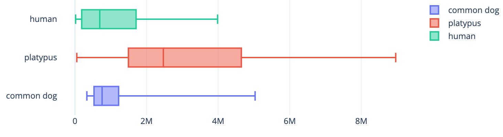
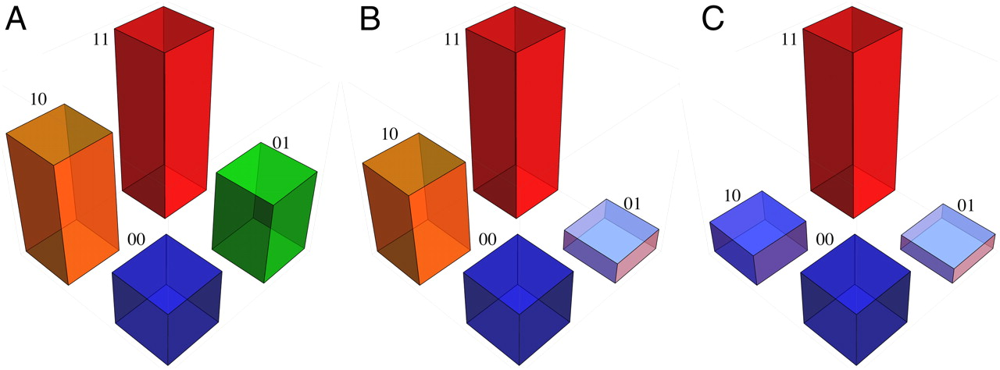
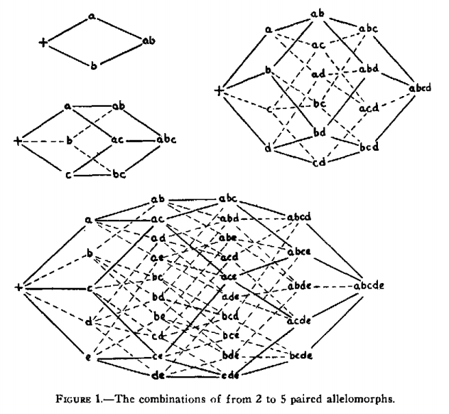

# darwinism final project
### nucleotide sequence matching through randomization

Class Genome_s generates a nucleotide sequence of given length, then maps random single nucleotide mutations until the modified sequence matches the one provided.

    def __init__(self, s):
        self.__size = len(s)
        self.__data = self.__d_genome(s)

    def __d_genome(self, s):
        res = [self.__pair_map(n) if bool(rand.getrandbits(1)) else n for n in s]
        return str().join(map(str, res))

    def __replacer(self, v, x):
        self.__data = self.__data[0:x] + v + self.__data[x + 1 :]

    def __pair_map(self, v):
        return {"A": "T", "G": "C", "T": "A", "C": "G"}.get(v)

    def __r_modify(self, x):
        self.__replacer(self.__pair_map(self.__data[x]), x)

    def get_data(self):
        return self.__data

    def r_change(self):
        loc = sec.randbelow(self.__size)
        self.__r_modify(loc)
        
with n_finder_s calling the genome function and returning the number of changes required:

    def n_finder_s(s):
        g = Genome_s(s)
        n = 0

        while g.get_data() != s:
            g.r_change()
            n += 1

        return n

### example outcomes

Using the first twenty-one nucleotide sequence from various organisms' chromosome one, the following number of random mutations occured until the random sequence matched the twenty-one-long chromosome one sequence.

The function for results from human sequence would be called as follows:

    n_finder_s("TAACCCTAACCCTAACCCTAA")

| human sequence | platypus sequence | common dog sequence |
| -------------- | ----------------- | -------------------|
| TAACCCTAACCCTAACCCTAA | CCCTAACCCCCACTTTCCTGG | TATGTGAGAAGATAGCTGAAC |

| human sequence mutations | platypus sequence mutations | common dog mutations |
| ------------------------ | --------------------------- | -------------------- |
| 333276  | 6595197 | 92532   |
| 541716  | 1492468 | 3489220 |
| 972810  | 1604850 | 421940  |
| 531688  | 8961044 | 3985825 |
| 972810  | 2172279 | 188456  |
| 531688  | 2763512 | 1708099 |
| 333591  | 458602  | 1543731 |
| 1638374 | 4647228 | 965247  |
| 5031016 | 51397   | 17387   |
| 1218071 | 3658662 | 347687  |

Interestingly enough, there was high variation between different species, even though the number of nucleotides used was kept constant. The Platypus (Ornithorhynchus Anatinus) consistently reported greater sequence mutations required when starting from a randomly generated sequence.

 

### academic references

Although our program demonstrates (in a very abstract manner) that the number of possible nucleotide variations is incredibly high single change mutations between species are highly variable, the results are not necessarily applicable to reality. Although we originally had insertions and deletions in our program, the run-time of the function was incredibly high (beyond an easily returnable value) because the length of the modified sequence would take too long to equal the specified organismic sequence.

In *Natural Selection and the Concept of a Protein Space*, John Maynard Smith discusses how "functional proteins must form a continuous network which can be traversed by unit mutational steps without passing through nonfunctional intermediates." So, even though it may take a few hundred thousand random changes to produce a portion of the human genome from a random sequence, each of those changes certainly did not produce functional organisms along the way.

However, according to Carneiro and Hartl in *Adaptive landscapes and protein evolution*, Smith's protein space is limited in that "it is usually unknown whether altering a particular amino acid in a protein results in a change in fitness that is beneficial, neutral, or deleterious, hence it is unclear which amino acid replacements are allowed." As such, even though there is a near-infinite amount of nucleotide changes which could take place, which ones produce fitness changes is not easily calculated.

This idea is exemplified in the diagram below, in which two possible amino acids and the respective organismic fitness as a result of their combinations is presented. The height of each cube is "proportional to the fitness of organisms having mutant proteins with combinations of two variant amino acids."

 

Carneiro and Hartl build upon the earlier works of Wright in *The roles of mutation, inbreeding, cross-breeding and selection in evolution.* Specifically, the various possible routes in which a certain genetic sequence can develop is mapped below, whereby the figure below shows the cimbinations in the cases of 2 to 5 paired allelomorphs.

 

Wright provides multiple hypotheses for the reason of certain paths being pursued in nature. One possibility is that "a particular combination gives maximum adaptation and that the adaptiveness of the other combinations falls off more or less regularly according to the number of removes." As our script is entirely randomized, the nucleotide changes are not proportional to the actual number which would be found in a natural pathway.

An additional factor to account for is the extent to which functional proteins can arise from each sequence in the pathway. For example, of the instances run above, how many of the one-million-long pathways was composed of fully functional sequences? Even though only twenty-one nucleotides were used, the seven amino acids encoded may be highly variant according to the standard genetic code, including such possibilites as stop codons. Additionally, frame shift mutations, such as insertions or deletions, could produce drastically different outcomes. 

This idea is further explored in *Functional proteins from a random-sequence library*, where Keefe and Szostak analyze "how frequently functional, or even folded, proteins occur in collections of random sequences" using *in vitro* selection of messenger RNA displayed proteins. Their pre-generated DNA library "encodes proteins with 80 contiguous random amino acids" which are then mutated to see how many successive proteins are functional. Their conclusion, which is highly relevant to our project, is that "functional proteins are sufficiently common in protein sequence space (roughly 1 in 10^11)."

Slight modification to our project (as shown below) allows for the evolutionary pathway to be viewed.

    while g.get_data() != s:
        g.r_change()
        print(g.get_data())
        n += 1

Starting with the randomly generated sequence of CCTTCT, the following changes occured in order to reach GCTAGT. Insertions and deletions were removed from the code in order to heavily reduce the length of the pathway:

| CCTTCT |  CCATCT |  CGATCT | CCATCT | CCTTCT | CGTTCT |  CGATCT |
| ------ | ------ | ------ | ------ | ------ | ------ | ------ |

and then seven more:

| CGATGT|  CGAAGT|  CGAACT|  GGAACT | GCAACT | GCTACT | GCTAGT |
| ------ | ------ | ------ | ------ | ------ | ------ | ------ |

Further exploration of academic literature pertinent to the subject provides the topic of directed evolution, which, as is explored by Romero and Arnold in *Exploring protein fitness landscapes by directed evolution*, "circumvents our profound ignorance of how a protein's sequence encodes its function by using iterative rounds of random mutation and artificial selection to discover new and useful proteins." As such, our program provides a reduced sample of this hypothesis, where with additional analysis, the usefulness of each successive repetition of protein sequences could be found. However, as stated before, the deleterious nature of many mutations is not accounted for in our program, although due to this fact "most paths end downhill, with inactive proteins, rather than uphill at more-fit sequences." To produce a pathway of exclusively positive-fit mutations would be much more complicated and require sequencing of the entire genome. 

An additional viewpoint on this subject, and a perhaps fitting conclusion to this analysis, is provided by DePristo, Weinreich, and Hartl in *Missense meanderings in sequence space: a biophysical view of protein evolution*. For, in the way that there are many possible effects of mutations in the genetic sequence, both in *cis* and *trans* configurations such that other locations on a chromosome may additionally be impacted, "mutations simultaneously affect function, stability, aggregation and degradation." For these reasons, "mutations might be selectively beneficial on some genetic backgrounds and deleterious on others."

Because of the manner in that "proteins tolerate only narrow ranges of stability, aggregation propensity and degradation rate," many of the mutations in our sequences would cause the total elimination of that pathway. Insertions and deletions can produce dramatic reading frame shifts, and the subsequent changes in proteins would be highly detrimental to genetic development. Therefore, our program provides only an abstract idea of evolutionary pathways in the production of functional genetic sequences, as most nucleotide sequence mutations are deleterious and harmful.
