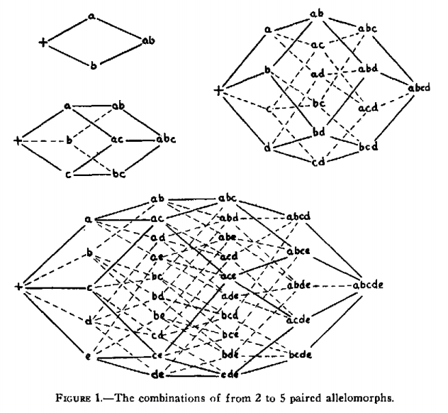
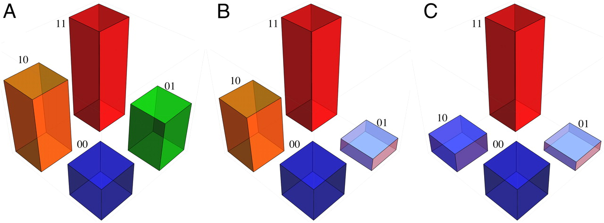
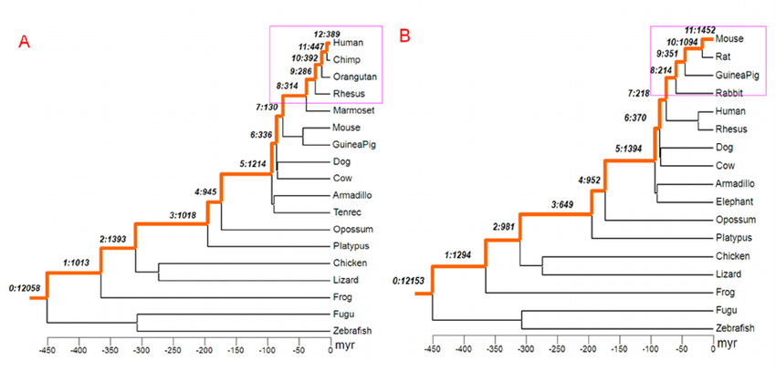

# understanding darwinism final project

There are two portions to this final project. The first is a program which attempts to find the ancestral protein sequences for organisms which have a shared protein, and the second is a program demonstrating the extent of variation between organismic DNA sequences through stochastic modeling.

### finding ancestral protein sequences using derived organisms

In *The roles of mutation, inbreeding, cross-breeding and selection in evolution,* Sewall Wright explains gene interactions and varying degrees of fitness using mathematical modeling, applying the idea of an adaptive landscape to different gene expressions in similar species. In the graph shown below, the various possible routes in which a certain genetic sequence can develop is mapped, whereby the figure shows fitness in gene combinations in the cases of 2 to 5 paired allelomorphs.

 

Wright provides multiple hypotheses for the reason of certain paths being pursued in nature. One possibility is that a particular combination gives maximum adaptation and that the adaptiveness of the other combinations falls off more or less regularly according to the number of removes. An additional factor to account for is the extent to which functional proteins can arise from each sequence in the pathway. Because many insertions, deletions, and single amino acid mutations are highly deleterious, the possibility of a protein sequence evolving in a positive way is highly unlikely.

One of the most emphasized points which the graph above is used for pertains to the specific pathway undertaken by natural selection in producing specific proteins. By analyzing the amino acid sequence of a shared protein of relatives, the particular pathway undertaken in nature may be observed.

For example, in the case of the HOXB5 gene (which encodes for lung and gut development), the following sixty-amino acid sequence is present in zebrafish (Danio rerio), frogs (in this example, Xenopus tropicalis), chickens (Gallus gallus), dogs (Canis familiaris), and humans:

    GKRARTAYTRYQTLELEKEFHFNRYLTRRRRIEIAHALCLSERQIKIWFQNRRMKWKKDN

Natural selection must not have seen changing this specific protein sequence as a necessity. Indeed, the process of change in genetic sequences is complicated: in *Natural Selection and the Concept of a Protein Space*, John Maynard Smith discusses how functional proteins must form a continuous network which can be traversed by unit mutational steps without passing through nonfunctional intermediates. So, even though it may take a few hundred thousand random changes to produce a portion of the human genome from a random sequence (as seen in the program below), each of those changes certainly did not produce functional proteins along the way.

Of course, this is not the case for every protein sequence in multicellular organisms. The p53 tumor suppression protein, a gene that codes for a protein that regulates the cell cycle and functions as a tumor suppressor, undergoes multiple changes in the same pathway above.

While the zebrafish has the following one-hundred-and-ninety-one sequence:

    DYPGDHGFRLRFPQSGTAKSVTCTYSPDLNKLFCQLAKTCPVQMVVDVAPPQGSVVRATAIYKKSEHVAEVVRRCPHHERTPDGDNLAPAGHLIRVEGNQRANYREDNITLRHSVFVPYEAPQLGAEW TTVLLNYMCNSSCMGGMNRRPILTIITLETQEGQLLGRRSFEVRVCACPGRDRKTEESNFKKD

the Xenopus tropicalis frog has a slightly different one-hundred-and-ninety-one sequence:

    DYAGKYGLQLDFQQNGTAKSVTCTYSPELNKLFCQLAKTCPLLVRVESPPPRGSILRATAVYKKSEHVAEVVKRCPHHERSVEPGEDAAPPSHLMRVEGNLQAYYMEDVNSGRHSVCVPYEGPQVGTECTTVLYNYMCNSSCMGGMNRRPILTIITLETPQGLLLGRRCFEVRVCACPGRDRRTEEDNYTKK
    
and Gallus gallus has an even different variation of the same size:

    DYGGDFDFRVGFVEAGTAKSVTCTYSPVLNKVYCRLAKPCPVQVRVGVAPPPGSSLRAVAVYKKSEHVAEVVRRCPHHERCGGGTDGLAPAQHLIRVEGNPQARYHDDETTKRHSVVVPYEPPEVGSDCTTVLYNFMCNSSCMGGMNRRPILTILTLEGPGGQLLGRRCFEVRVCACPGRDRKIEEENFRKR
    
In spite of the fact that the first amino acid in the protein sequence remains aspartic acid and the second tyrosine, the third has mutated from proline to alanine to glycine. These are all non-polar amino acids with the amino acid proceeding remaining glycine in all three cases, underlining the theory of Smith in which these mutations must not have interrupted functionality. It's not until the Homo sapien that the sequence becomes one-hundred-and-ninety long and undergoes drastic change:

    TYQGSYGFRLGFLHSGTAKSVTCTYSPALNKMFCQLAKTCPVQLWVDSTPPPGTRVRAMAIYKQSQHMTEVVRRCPHHERCSDSDGLAPPQHLIRVEGNLRVEYLDDRNTFRHSVVVPYEPPEVGSDCTTIHYNYMCNSSCMGGMNRRPILTIITLEDSSGNLLGRNSFEVRVCACPGRDRRTEEENLRKK

Though like the aspartic acid in the preceeding relatives, the threonine in the first position is also polar. Various other changes in the sequence also occur, but the minimal nature of the amino acid changes and their failure to become drastically different (e.g., non-polar to polar, large to small) exemplify natural selection through genetic sequence changes.

According to Carneiro and Hartl in *Adaptive landscapes and protein evolution*, Smith's protein space is limited in that it is usually unknown whether altering a particular amino acid in a protein results in a change in fitness that is beneficial, and therefore it is unclear which amino acid replacements produce functional proteins. As such, even though there is a near-infinite amount of nucleotide changes which could take place, which ones produce fitness changes is not easily calculated.

This idea is exemplified in the diagram below, in which two possible amino acids and the respective organismic fitness as a result of their combinations is presented. The height of each cube is "proportional to the fitness of organisms having mutant proteins with combinations of two variant amino acids."

 

Although the ideas of Carneiro and Hartl are not as relevant in the changes to the p53 tumor suppression protein, the idea of not knowing whether an amino acid change is deleterious is explored in the first program, proteins.py.

Using the following graph as a model:

 

Take the protein sequence of an organism, such as the epidermal growth factor protein in the transmembrane domain (in this case, Canis lupus):

    VAAVAVGVVVLVLLLLLGLGG
    
and the same protein sequence for an older relative (Gallus gallus):

    ITIAVCIAVLLLLLGSLAAYCS

and the protein sequence from an even older relative along the same lineage (Xenopus tropicalus):

    VTIAVSLLLLLLILGLGSFATYYY
    
and, using amino acids which remain the same in the same position, we can attempt to find the sequence in the common ancestor:

    VTIAVCIVLLLLILSLASLITYCY
    
The script uses single amino acid changes to predict the protein sequence in the shared common ancestor of relevant organisms. In the above case, all organisms are in the phylum Chordata, and all express the epidermal growth factor protein in a similar manner. Because the amino acids are all functional in their respective organisms, the prediction should not place non-functional residues at any position. An additional viewpoint on this subject, and a perhaps fitting conclusion to this analysis, is provided by DePristo, Weinreich, and Hartl in *Missense meanderings in sequence space: a biophysical view of protein evolution*. For, in the way that there are many possible effects of mutations in the genetic sequence, both in *cis* and *trans* configurations such that other locations on a chromosome may additionally be impacted, mutations simultaneously affect function, stability, aggregation and degradation. 

For these reasons, mutations might be selectively beneficial on some genetic backgrounds and deleterious on others. Although our program encodes the ancestral protein sequence using the most-frequently-displaying amino acid at each position, multiple amino acid changes likely act concordantly with one another, producing necessary changes for the most positive fitness of that organism. Compensatory mutations, as per Hartl, therefore function by relieving the biophysical strain that is introduced by adaptive mutations. Between Gallus gallus and Canis lupus, there may have been a fitness reason for the adaptation from valine to isoleucine which also manifested in amino acid changes in the downstream sequence. These necessities could not have been easily accounted for in our program. However, priority is given to amino acids which are present in the more-ancestral delineations, as these may have occurred closer in time to the shared ancestor as per the graph above.

### nucleotide sequence matching through randomization

Class Genome_s generates a nucleotide sequence of given length, then maps random single nucleotide mutations until the modified sequence matches the one provided.

    def __init__(self, s):
        self.__size = len(s)
        self.__data = self.__d_genome(s)

    def __d_genome(self, s):
        res = [self.__pair_map(n) if bool(rand.getrandbits(1)) else n for n in s]
        return str().join(map(str, res))

    def __replacer(self, v, x):
        self.__data = self.__data[0:x] + v + self.__data[x + 1 :]

    def __pair_map(self, v):
        return {"A": "T", "G": "C", "T": "A", "C": "G"}.get(v)

    def __r_modify(self, x):
        self.__replacer(self.__pair_map(self.__data[x]), x)

    def get_data(self):
        return self.__data

    def r_change(self):
        loc = sec.randbelow(self.__size)
        self.__r_modify(loc)
        
with n_finder_s calling the genome function and returning the number of changes required:

    def n_finder_s(s):
        g = Genome_s(s)
        n = 0

        while g.get_data() != s:
            g.r_change()
            n += 1

        return n

#### example outcomes

Using the first twenty-one nucleotide sequence from various organisms' chromosome one, the following number of random mutations occured until the random sequence matched the twenty-one-long chromosome one sequence.

The function for results from human sequence would be called as follows:

    n_finder_s("TAACCCTAACCCTAACCCTAA")

| human sequence | platypus sequence | common dog sequence |
| -------------- | ----------------- | -------------------|
| TAACCCTAACCCTAACCCTAA | CCCTAACCCCCACTTTCCTGG | TATGTGAGAAGATAGCTGAAC |

| human sequence mutations | platypus sequence mutations | common dog mutations |
| ------------------------ | --------------------------- | -------------------- |
| 333276  | 6595197 | 92532   |
| 541716  | 1492468 | 3489220 |
| 972810  | 1604850 | 421940  |
| 531688  | 8961044 | 3985825 |
| 972810  | 2172279 | 188456  |
| 531688  | 2763512 | 1708099 |
| 333591  | 458602  | 1543731 |
| 1638374 | 4647228 | 965247  |
| 5031016 | 51397   | 17387   |
| 1218071 | 3658662 | 347687  |

Although our program demonstrates (in a very abstract manner) that the number of possible nucleotide variations is incredibly high and that single change mutations between species are highly variable, the results are not necessarily applicable to reality. Although we originally had insertions and deletions in our program, the run-time of the function was beyond an easily returnable value, in part because the length of the modified sequence would take too long to equal the specified organismic sequence.

Of the instances run above, how many of the one-million-long pathways was composed of fully functional sequences? Even though only twenty-one nucleotides were used, the seven amino acids encoded may be highly variant according to the standard genetic code, including such possibilites as stop codons. Additionally, frame shift mutations, such as insertions or deletions, could produce drastically different outcomes. As such, the program seeks to represent the creationist, stochastic model of natural selection, which follows more of a random, meandering path. More literature on the subject is found in discussions by Gould.

This idea is further explored in *Functional proteins from a random-sequence library*, where Keefe and Szostak analyze how frequently functional proteins occur in series of random sequences using *in vitro* selection of messenger RNA displayed proteins. Their pre-generated DNA library encodes proteins with eighty contiguous random amino acids which are then mutated to see how many successive proteins are functional. Their conclusion, that functional proteins are sufficiently common in protein sequence space (roughly 1 in 10^11), puts into context how many of the millions of randomly-changed nucleotide sequences in our program are functional: almost none!

The analyses of Keefe and Szostak are additionally relevant to the first protein sequence program, in that the calculated amino acid sequences of the ancestral protein likely fail to account for full functional changes. In the sequence examples above, the transformation of valine to isoleucine may have been functional only with additional changes downstream--so the ancestral protein may not be fully functional. 

Slight modification to our project (as shown below) allows for the evolutionary pathway to be viewed.

    while g.get_data() != s:
        g.r_change()
        print(g.get_data())
        n += 1

Starting with the randomly generated sequence of CCTTCT, the following changes occured in order to reach GCTAGT. Insertions and deletions were removed from the code in order to heavily reduce the length of the pathway:

| CCTTCT |  CCATCT |  CGATCT | CCATCT | CCTTCT | CGTTCT |  CGATCT |
| ------ | ------ | ------ | ------ | ------ | ------ | ------ |

and then seven more:

| CGATGT|  CGAAGT|  CGAACT|  GGAACT | GCAACT | GCTACT | GCTAGT |
| ------ | ------ | ------ | ------ | ------ | ------ | ------ |

Further exploration of academic literature pertinent to the subject provides the topic of directed evolution, which, as is explored by Romero and Arnold in *Exploring protein fitness landscapes by directed evolution*, "circumvents our profound ignorance of how a protein's sequence encodes its function" (quotation for emphasis) by using iterative rounds of random mutation and artificial selection to discover new and useful proteins. As such, our program provides a reduced sample of this hypothesis, where with additional analysis, the usefulness of each successive repetition of protein sequences could be found. However, as stated before, the deleterious nature of many mutations is not accounted for in our program, where most paths end downhill, with inactive proteins, rather than with functional sequences. To produce a pathway of exclusively positive-fit mutations would be much more complicated and require sequencing of the entire genome.

Because of the manner in that "proteins tolerate only narrow ranges of stability, aggregation propensity and degradation rate," many of the mutations in our sequences would cause the total elimination of that pathway. Insertions and deletions can produce dramatic reading frame shifts, and the subsequent changes in proteins would be highly detrimental to genetic development. Therefore, our program provides only an abstract idea of evolutionary pathways in the production of functional genetic sequences, as most nucleotide sequence mutations are deleterious and harmful. An emphasis must be put on the representation of stochastic natural adaptation which is found in this program, where each new iteration of the program produces a different evolutionary pathway.
